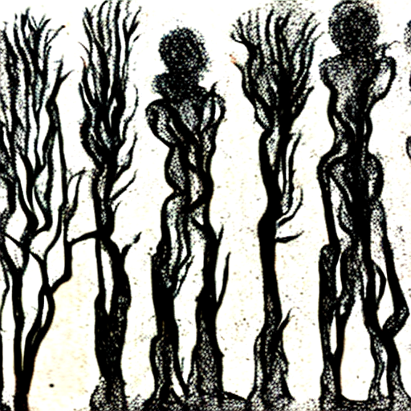
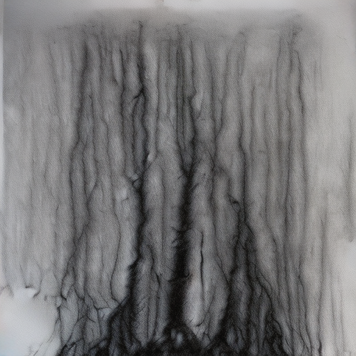

Vast phantom housing estate inhabited by shadows, transparent to the
eye, veiled in grey half-light, half-darkness. In the midst of this
suburbia, a forest as of old, enchanted, labyrinthine. At the end of a
half glimpsed street, a wall of trees, shifting, restless, employed upon
some business. The whole forest alive with activity as we enter. Light
increases as we penetrate. We are shadows, transparent to the eye,
unnoticed by the inhabitants.

Description of inhabitants.

Two types.

From waist up, human. Waist down, a tree trunk rooted in the earth.

From waist down, human. Waist up, tree trunk branching upwards.

Variation in size and material interrelated. The larger the inhabitant
the harder and more brittle the material. The human parts, warm-blooded
flesh. The plant parts, plant-material.

We could not discern how these two incompatible materials coexisted in
one body. Being without means to capture and dissect one of these
creatures the mystery was compelled to remain.

What we did observe was that a number of relationships appeared to bind
these forest creatures together.

In order to refer to them in relation to their type we named them.

Those with lower human and upper plant parts we named a BRANCHY.

Those with upper human and lower plant parts we named a ROOTY.

A large Branchy with a small Branchy.

A large Rooty with a small Rooty.

A large Branchy with a small Rooty.

A large Rooty with a small Branchy.

A Branchy lives in a roofless hut in which it walks around and around
until finally settling for a time in a chair or in some cases, sofa. The
period of rest is soon interrupted by an apparent compulsion to resume
the restless perambulation. At first again around the hut, until finally
out again into the forest.

A Rooty never goes anywhere alive for long, so they endeavour to remain
rooted. Their time is divided between conversation amongst themselves
and sap-dealing with the Branchies.

In conversation each Rooty is related to a group of neighbouring Rooties
Each group is graduated in relation to distance. The further away the
louder they have to whisper speak shout or yell. Each Rooty is thus to
varying degrees within a variety of groups, and absolutely within its
own.

The writing on leaves, removed and replaced on wandering Branchies has
led to further and more obscure groupings.

Sap-dealing is essential here. Without it a Branchy would wither and
die. Rooties contemplate this prospect with dismay meaning as it does a
loss of income. The currency used in these sap-transactions is genital
play. In exchange for allowing itself to be fondled a Branchy receives
an amount of sap. Those Rooties grown out of reach of the genitalia of
lower Branchies ascend to the genitalia of those Branchies at their own
level. In general a set of Rooties and Branchies will grow at
approximately the same rate thus forming a recognisable trading group.
The taller the Rooty or Branchy the fewer in number. Thus greater
infrequency in their trade dealings.

Lacking the ability to enter the soil our knowledge of the subterranean
extent of a Rooty had to be surmised from examination of those Rooties
for one reason or another uprooted.

It became obvious that in their botanomorphic parts the Rooties and
Branchies are in fact inversions of each other.

Below the soil a Rooty branched out into ever-thinning members.

Upon moderate fluency in the languages of the Rooties we learnt from
remarks amongst themselves that they supposed, for they were great
theorists themselves, that the sap they drew up from deep within the
earth by means of what they referred to as their *branches*.

It was a source of some pride to them that they had buried these
*branches* within the protection of the soil and doubly prudent in that
in this measure also supplied them with the substance with which they
exerted their economic hold over the Branchies. Who, as a Rooty was
often heard to remark had carelessly exposed their botanomorphic parts
to the vagaries of the environment.

The general appearance of a Branchy denied its name. The dense
population of the forest made for so much violent and incapacitating
congestion amongst the Branchies that the botanomorphic parts reaching
outward as they did filling the space above a Branchy\'s trunk, were so
frequently entangled and broken that it was not infrequent to see a
Branchy entirely pollarded by this abrasion.

The less the encumbrance a Branchy carries upon the top half of its body
the faster it is enabled to progress upon its headlong course. Being
both streamlined and hammer-like.

The compulsion to move is clearly more powerful than the need to
preserve an independent means of sustenance. This was not clear to us at
first. Lacking the means to study the soon destroyed growths beyond what
we could observe by drifting amongst them, we were at a loss to
ascertain their relevance or function in the life of a Branchy. They
were it seemed to us useless whimsicalities exuded in much the same
spirit and circumstances as the aforementioned languages of the Rooties.
These endless speculations and suppositions of Rooty conversation all
too clearly met the same fate as the destroyed growths of the Branchies,
being broken and destroyed in the incessant contradiction that existed
among the tightly planted Rooties.

It was only after observing how those Branchies injured in their lower
anthropomorphic part compelled by their inability to move to convalesce
and await the outcome of their injuries, whether they would heal or not
sufficient for them to return to the paths. As they waited they
underwent an extra-ordinary change. Fresh growths appeared from their
pollarded crowns, in great quantity and succulent in appearance. How was
it, we reasoned amongst ourselves, that these Branchies were able to
survive so long and in an injured and restless condition and yet receive
no sap which prior to their injuries had been so regularly vital in
their lives. The answer clearly lay in the growths. On the subject of
these growths we gleaned from the languages of the Rooties that they
believed that in the case of these growths a Branchy was in fact
*receiving sap from the light,* photosynthesis in other words. Rooties
clearly were uneasy and had mixed feelings concerning these growths.

Visually they approved of them calling them attractive. Indeed a
recently recovered Branchy was considered eminently desirable perhaps
not least on account of momentary sap-sufficiency. But despite these
attractions the sight of those growths represented to the Rooties the
inherent independence of the Branchies and with that the demise of their
economic hold over them.

Both Rooty and Branchy vary greatly in size. The spaces between the
larger being occupied by smaller.

The smaller the Rooty or Branchy the more tender its botanomorphic part.
The larger the more brittle.

The interweaving of the paths divide the forest into the groups they
define. A sufficiently clearly defined group or area we termed a
thicket.

At the centre of a thicket live the smallest Rooties, the largest being
arranged around the perimeter.

Each size group has its own appropriately sized path.

Where a path used by a group of small Branchies encounters a large
Branchy path the traffic of the large Branchies is usually sufficient to
result in a trampling underfoot of small Branchies. Should this happen
the small mound of tender Branchy corpses is usually sufficient to
impede the flow and thus direct the traffic of small Branchies
elsewhere.

It is from within this humus that new Rooties appear to spontaneously
generate.

